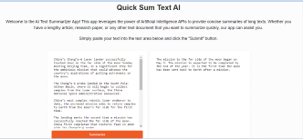

<!-- Improved compatibility of back to top link: See: https://github.com/othneildrew/Best-README-Template/pull/73 -->

<!--
*** Thanks for checking out the Best-README-Template. If you have a suggestion
*** that would make this better, please fork the repo and create a pull request
*** or simply open an issue with the tag "enhancement".
*** Don't forget to give the project a star!
*** Thanks again! Now go create something AMAZING! :D
-->

<!-- PROJECT SHIELDS -->
<!--
*** I'm using markdown "reference style" links for readability.
*** Reference links are enclosed in brackets [ ] instead of parentheses ( ).
*** See the bottom of this document for the declaration of the reference variables
*** for contributors-url, forks-url, etc. This is an optional, concise syntax you may use.
*** https://www.markdownguide.org/basic-syntax/#reference-style-links
-->

<!-- PROJECT LOGO -->
 

    
  </a>

  <h3 align="center">AI Text Summarizer</h3>

<!-- ABOUT THE PROJECT -->
## About The Project

  

    
  </a>

    
This AI-powered text summarizer web app is a comprehensive and user-friendly application designed to create concise summaries of large text inputs. Built using modern web development technologies, it leverages the power of artificial intelligence through the Hugging Face Inference API to provide efficient and accurate text summarization.

(<a href="#readme-top">back to top</a>)

<!-- TECHNOLOGIES USED -->
## Technologies used
* [![Node.js][Node.js]][Node-url]
* [![Express][Express]][Express-url]
* [![Hugging Face][HuggingFace]][HuggingFace-url]
* [![HTML][HTML]][HTML-url]
* [![CSS][CSS]][CSS-url]
* [![JavaScript][JavaScript]][JavaScript-url]

(<a href="#readme-top">back to top</a>)

<!-- GETTING STARTED -->
## Getting Started

To run this project, you need the following software installed:

* Node.js (latest version)
* Replit account for deploying your application
* Postman for API exploration and integration

(<a href="#readme-top">back to top</a>)

<!-- LICENSE -->
## License
Distributed under the MIT License.

(<a href="#readme-top">back to top</a>)

<!-- CONTACT -->
## Contact
Kerem Bjälvenäs Tazedal - kerem.tazedal.89@gmail.com

Project Link: [https://github.com/Kerem1989/quick-sum-text-AI](https://github.com/Kerem1989/quick-sum-text-AI)

<!-- MARKDOWN LINKS & IMAGES -->
<!-- https://www.markdownguide.org/basic-syntax/#reference-style-links -->
[contributors-shield]: https://img.shields.io/github/contributors/othneildrew/Best-README-Template.svg?style=for-the-badge
[contributors-url]: https://github.com/othneildrew/Best-README-Template/graphs/contributors
[forks-shield]: https://img.shields.io/github/forks/othneildrew/Best-README-Template.svg?style=for-the-badge
[forks-url]: https://github.com/othneildrew/Best-README-Template/network/members
[stars-shield]: https://img.shields.io/github/stars/othneildrew/Best-README-Template.svg?style=for-the-badge
[stars-url]: https://github.com/othneildrew/Best-README-Template/stargazers
[issues-shield]: https://img.shields.io/github/issues/othneildrew/Best-README-Template.svg?style=for-the-badge
[issues-url]: https://github.com/othneildrew/Best-README-Template/issues
[license-shield]: https://img.shields.io/github/license/othneildrew/Best-README-Template.svg?style=for-the-badge
[license-url]: https://github.com/othneildrew/Best-README-Template/blob/master/LICENSE.txt
[linkedin-shield]: https://img.shields.io/badge/-LinkedIn-black.svg?style=for-the-badge&logo=linkedin&colorB=555
[linkedin-url]: https://linkedin.com/in/othneildrew
[product-screenshot]: images/screenshot.png
[Node.js]: https://img.shields.io/badge/Node.js-339933?style=for-the-badge&logo=nodedotjs&logoColor=white
[Node-url]: https://nodejs.org/
[Express]: https://img.shields.io/badge/Express-000000?style=for-the-badge&logo=express&logoColor=white
[Express-url]: https://expressjs.com/
[HuggingFace]: https://img.shields.io/badge/Hugging%20Face-FFB000?style=for-the-badge&logo=huggingface&logoColor=white
[HuggingFace-url]: https://huggingface.co/
[HTML]: https://img.shields.io/badge/HTML-E34F26?style=for-the-badge&logo=html5&logoColor=white
[HTML-url]: https://developer.mozilla.org/en-US/docs/Web/HTML
[CSS]: https://img.shields.io/badge/CSS-1572B6?style=for-the-badge&logo=css3&logoColor=white
[CSS-url]: https://developer.mozilla.org/en-US/docs/Web/CSS
[JavaScript]: https://img.shields.io/badge/JavaScript-F7DF1E?style=for-the-badge&logo=javascript&logoColor=black
[JavaScript-url]: https://developer.mozilla.org/en-US/docs/Web/JavaScript

